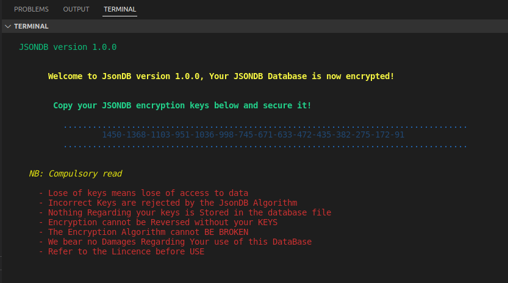

# JsonDB Database

A lightweight, easy to use, secured access, encryptable and practically fast Json based database for nodejs and the browser.

# JsonDB Documentation

For JsonDB 1.0.0

# Context Definitions for JsonDB

# creating a JsonDB object

---

```js
import JSONDB, { JSONDBversion } from "./index.js";
// creating a new JSONDB object
const database = new JSONDB();
console.log("JSONDB version " + JSONDBversion);
```

with the JsonDB object given a variable of database you can do everything
let get into how you should use it.

let's create a new database instance

# Creating a JsonDB instance

---

```js
// iniatialises a new JSONDB database instance and created the database file
database.init({
  name: "Student_exam_record_data_base",
  password: "password",
  username: "jsondb_username",
  encrypted: false,
});
```

this creates a database JSONDB file named Student_exam_record_data_base having
the given credentials

name > name of database
password > database connection password
username > your username
encrypted > if JSONDB should encrypt the data store

you need password and username to login into JSONDB when creating a connection
else you get an access denied error

# Creating a JsonDB conncetion

---

```js
const details = {
  password: "password",
  username: "jsondb_username",
};

// a connection needs details for security
const connection = await database.createJSONDBConnection(details);
```

with the connection you can get and modifile tables in the database

# Creating schema in JsonDB

---

schema is a table object definition standard for databases

a schema has a name columns and may have relations
when neccessary

```js
const ExamRecordSchema = database.schema({
  name: "ExamRecord",
  columns: {
    totalScores: {
      type: "number",
    },
    examDate: {
      type: "string",
      nullable: true,
    },
    totalSubjects: {
      type: "number",
    },
  },
});
```

This schema below Student has ExamRecord as it's relation,
type many means it can have many ExamRecords as it's relations
if one it's only going to have one but that one can be changed when needed

it can have a ton of relations

and you can add cascade: true to make the ExamRecord also keep the Student as it's relation

```js
// creating schema (tables) with relations in JSONDB
const StudentSchema = database.schema({
  name: "Student",
  columns: {
    Student_name: {
      type: "string",
    },
    age: {
      type: "number",
    },
    class: {
      type: "string",
    },
    handicap: {
      type: "boolean",
      nullable: true,
    },
    classNumber: {
      type: "number",
      unique: true,
    },
  },
  // adding relations definition
  relations: {
    ExamRecord: {
      target: ExamRecordSchema,
      type: "many",
    },
  },
});
```

# Assembling shema into your JsonDB instance

---

if you don't assemble your shemas you can't create tables for it definition

```js
// writes table schema into your JSONDB instance file
database.assemble([ExamRecordSchema, StudentSchema]);
```

# Definition for tables your JsonDB instance

---

JsonDB uses comprehensive verbs, making understanding the function of each JsonDB query clear

here's are the inbuilt querries for JsonDB, custom querries are not supported for now

```js
// creating and adding stuff into JSONDB tables
const table = connection.getTable("< the table name>");

table.save(newobject); // save your element to it's table in JsonDB
table.saveWithRelations(relatedElementTable, MainElement, relatedElement); // save relationship to Main Element

table.count(); // return the number of elements in the table
table.getOne(props); // get one element from the table with the given props object values
table.getAll(); // return an all of all the elements in the table
table.getWhereAny(props, number_or_nothing); // gets all or the give number of element with any of the given props value
table.getWhereAnyPropsIncludes(props, number_or_nothing); // get entities with the given prop of type "string" where the values specifiled is included
table.remove(element); // remove the element from the table indexing is still preserved don't worry
// more on the way like
// getWhere(), assert(), verify()
```

# Tutorial - Building a student database system

---

In this example we are building a simple unencrypted database for students for exam records

the comments below will take through it.

```js
// study this minimal example for student record

import JSONDB, { JSONDBversion } from "./index.js";
// creating a new JSONDB object
const database = new JSONDB();
console.log("JSONDB version " + JSONDBversion);
// iniatialises a new JSONDB database instance and created the database file
database.init({
  name: "Student_exam_record_data_base",
  password: "password",
  username: "jsondb_username",
  encrypted: false,
});

// creating schema (tables) in JSONDB
const ExamRecordSchema = database.schema({
  name: "ExamRecord",
  columns: {
    totalScores: {
      type: "number",
    },
    examDate: {
      type: "string",
      nullable: true,
    },
    totalSubjects: {
      type: "number",
    },
  },
});

// using relations in JsonDB
const StudentSchema = database.schema({
  name: "Student",
  columns: {
    Student_name: {
      type: "string",
    },
    age: {
      type: "number",
    },
    class: {
      type: "string",
    },
    handicap: {
      type: "boolean",
      nullable: true,
    },
    classNumber: {
      type: "number",
      unique: true,
    },
  },
  // adding relations definition
  relations: {
    ExamRecord: {
      target: ExamRecordSchema,
      type: "many",
    },
  },
});

// writes table schema into your JSONDB instance file
database.assemble([ExamRecordSchema, StudentSchema]);

const details = {
  password: "password",
  username: "jsondb_username",
};

// a connection needs details for secured access security feature
const connection = await database.createJSONDBConnection(details);

// creating and adding stuff into JSONDB tables
const StudentTable = connection.getTable("Student");
let Student = {
  Student_name: "friday candour",
  age: 121, // years old
  class: "Senior javascript/typescript developer full stack and mobile",
  handicap: false,
  classNumber: 1, // this unique remember
};

const save_Student = await StudentTable.save(Student);
console.log(save_Student);

const ExamRecordTable = connection.getTable("ExamRecord");
const ExamRecord = {
  totalScores: 1000,

  //  examDate: Date(), //humm this is nullable yeah
  // nullable means it can be empty without any value

  totalSubjects: 1000,

  // this following fake properties will not be added
  // because they are not in the schema even if you put them above those
  // it works  :)
  hello: "am friday candour and i love coding",
  this_fake_properties_will_not_be_added: "hello world",
};

const Exam_record = await ExamRecordTable.save(ExamRecord);

const ExamRecord2 = {
  totalScores: 10,
  examDate: Date(), // was given this time
  totalSubjects: 1000,
};

const Exam_record2 = await ExamRecordTable.save(ExamRecord2);

const allExamRecord = await ExamRecordTable.getAll();
const allStudent = await StudentTable.getAll();
console.log(allExamRecord, allStudent);

// saving with relations in JSONDB
// note save before saving with a relation
await StudentTable.saveWithRelations(
  ExamRecordTable,
  save_Student,
  Exam_record
);
await StudentTable.saveWithRelations(
  ExamRecordTable,
  save_Student,
  Exam_record2
);

const get = await ExamRecordTable.getWhereAny({ totalScores: 10 }, 1);
console.log(get);
```

# Project update

### Database encryption in beta mode

- in encryption mode JsonDB knows if you are the admin by testing your keys

- encryption has an impressive algorimth but is in beta mode please avoid using till the next update

- Data encryption in progress

#### usage

```js
// @examples
// study this minimal example for student record

import JSONDB from "./index.js";
// creating your new JSONDB object
const database = new JSONDB();

// iniatialises your new JSONDB database instance which creates your database encryptable file
database.init({
  name: "Student_exam_record_data_base",
  password: "password",
  username: "jsondb_username",
  encrypted: true, // the journey begins
});
// have a look at your terminal,
// in production make sure logging is enable on your server
// copy your keys and clear your terminal

// It's needed only during connection to the JsonDB instance

const details = {
  password: "password",
  username: "jsondb_username",
  // use DotEnv to store it, it's not recommended you input it like this
  keys: "1450-1368-1103-951-1036-998-745-671-633-472-435-382-275-172-91",
};

// a connection needs details for security
const connection = await database.createJSONDBConnection(details);
```

##### This is what you should see.

copy your keys and save



# problems to solve

- .getWhereAny() needs the fastest algorithm
- saving with relations works but the cascade option doesn't for now
- ruminant data encryption > almost done! :)
- support for browser via local storage

# More

- If well pretty JsonDB is under 700 lines of code right now
- With JsonDB encryption you don't need a bycrypt, jobs done!
- It's now super tiny, fast, secured access, encryptale and easy to use database

      JSON DB DataBase MIT Licence © 2022
      ------------------------------------

      Created by Friday Candour @uiedbooker

      email > fridaymaxtour@gmail.com
      github > www.github.com/FridayCandour
      telegram > @uiedbooker

      Love creativity? hook me up.

      JSONDB @version 1.0.0

```

```
